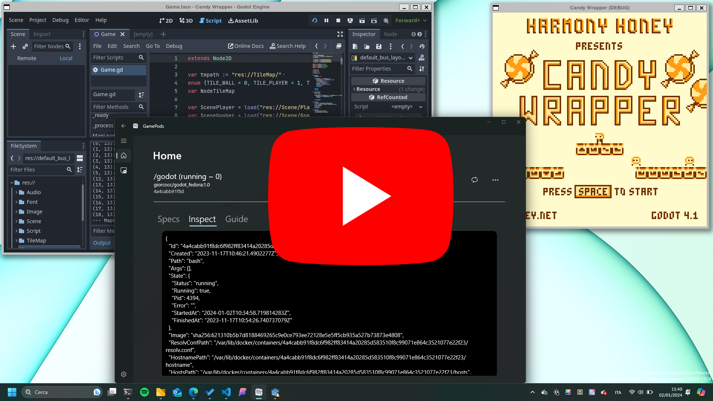
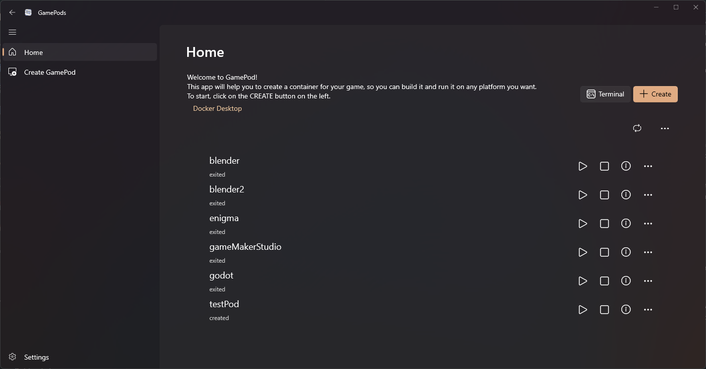
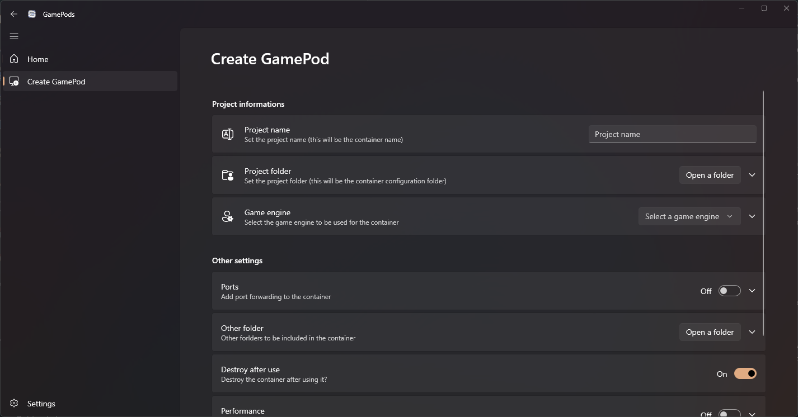

# GamePod


GamePod is a Windows tool based on Docker Engine, to create and menage Linux container built specifically for gaming development.

[](https://www.youtube.com/watch?v=hBs6m7Ih4io)

---

- [GamePod](#gamepod)
  - [Installation](#installation)
  - [Usage](#usage)
  - [Resources and Credits](#resources-and-credits)
    - [Project structure](#project-structure)
    - [Libraries and Tools](#libraries-and-tools)

---

## Installation

To install GamePod, you need to download the latest release from the release page and run the installer.

**NOTE**: GamePod need Docker Engine to work, so if you don't have it installed, you have to install it before installing GamePod. It also need the Windows Subsystem for Linux version 2 (WSL2) to work properly, so if you don't have enabled it, run the following command in PowerShell as Administrator:

```powershell
dism.exe /online /enable-feature /featurename:Microsoft-Windows-Subsystem-Linux /all /norestart
wsl --set-default-version 2
```

## Usage

The main window of GamePod show the list of the container created. Every container can be started, stopped, restarted, deleted and opened in a terminal; the container can also be checked for updates in the status and to view a guide on how to use it.



You can create a Pod following the instruction in the create page. You mush insert a name for the Pod, the path to the project folder that you want to mount in the container and the game engine used to create the project. Other settings, like port binding, other folder to mount and performance settings can be set for the Pod.

Game engine supported:

- [Godot Engine](https://godotengine.org/) (with Editor GUI)
- [Pygame](https://www.pygame.org/news)
- Unity (Editor and Hub, available only via command line)
- [Enigma](https://enigma-dev.org/) (with Editor GUI)
- more to come...



Graphical application can be run with WSL2 and [WSLg](https://github.com/microsoft/wslg) installed alongside GamePod.So, you don't need to install a X server on Windows to run graphical application.

## Resources and Credits

The project is based on the following resources:

| Name | Version | Description |
| ---- | ------- | ----------- |
| .NET e C#       | 7.0.402  | Language and framework used to develop the application |
| Windows App SDK | 1.4      | SDK used to develop the application                       |
| Docker API      | 1.43     | API used to communicate with Docker Engine                |
| [Docker.DotNet](https://github.com/dotnet/Docker.DotNet)   | 3.125.2  | Library used to communicate with Docker Engine inside a .NET application |
| WSL             | 2.0.7.0  | Windows Subsystem for Linux                               |

### Project structure

The project is based on a client-server architecture, where the client is the GUI application and the server is the Docker Engine. The client communicate with the server via the Docker API, using the Docker.DotNet library.

The client is developed using the Windows App SDK, a new framework that allow to develop application for Windows 11 and Windows 10. The application is developed using the MVVM pattern, with the help of the MVVM Toolkit.

### Libraries and Tools

- [Template Studio](https://github.com/microsoft/TemplateStudio): Visual Studio 2022 extension to create project template for Windows App SDK
- [WinUI 3 Gallery](https://github.com/microsoft/WinUI-Gallery) and [Community Toolkit](https://github.com/CommunityToolkit): Microsoft application to demostrate the WinUI 3 controls and the correct usage of the WinUI3 framework

For Unity images, I used the [Unity Hub](https://hub.docker.com/r/unityci/hub) and the [Unity Editor](https://hub.docker.com/r/unityci/editor) images provided by GameCI. Go to the [GameCI](https://game.ci/docs/docker/docker-images/) website for more information about the images.

> Unity images are not provided by GamePod, but by GameCI. GamePod only use them to create the container. No graphical interaction with Unity is available with this images. More information about their usage can be found on the [guide page of the container](GamePod\GamePod\GamePod\Assets\GuidaUnityEditor.md).
